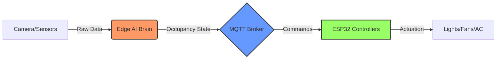
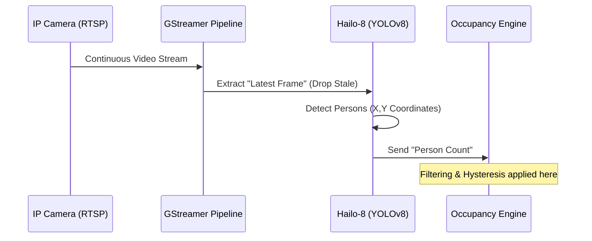
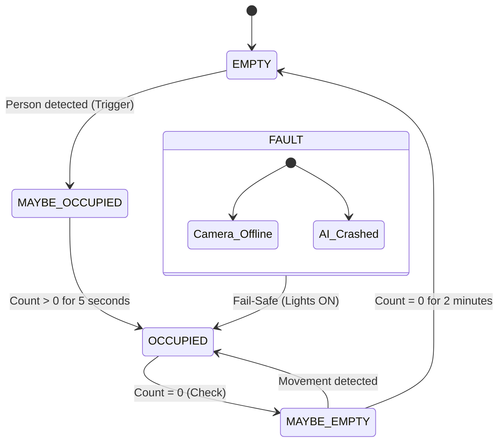

# LabOS: Industrial Smart Lab & Occupancy Intelligence
### Technical Architecture & Systems Engineering Manual

---

## 🚀 System Overview
**LabOS** is a distributed automation platform designed to turn standard laboratory infrastructure into an "Occupancy-Aware" intelligent environment. Unlike basic smart-home setups, LabOS uses **Edge AI** and **Industrial IoT principles** to ensure safety, energy efficiency, and 99.9% reliability.

### The Core Flow


---

## 1. The Vision System: Edge AI Inference
At the heart of LabOS is the **Edge AI System**. We don't use the cloud; we process everything locally on a **Raspberry Pi 5** accelerated by a **Hailo-8 AI Module**.

### 🧠 Why Edge AI?
*   **Privacy**: Visual data never leaves the lab. No "Big Brother" in the cloud.
*   **Speed**: Decisions happen in milliseconds (Low Latency).
*   **Reliability**: The lights still turn off if the internet goes down.

### 🛠️ The Vision Pipeline


> [!TIP]
> **Pro Engineering Tip: Stale Frame Prevention**
> In high-speed AI systems, processing every frame can lead to "backlog lag." LabOS uses a **Latest-Frame Architecture** where the AI only grabs the most recent frame from the buffer, effectively skipping older data to stay synchronized with real-time reality.

---

## 2. The Logic: Occupancy Engine
Detecting a person is easy; knowing if a room is "Occupied" is hard. A person might walk behind a pillar or stand still for 5 minutes. 

### 🔄 The State Machine
LabOS uses a **Deterministic State Machine** to prevent "flickering" (lights turning on and off rapidly).



---

## 3. The Nervous System: MQTT Architecture
LabOS uses **MQTT (Message Queuing Telemetry Transport)**. Think of it as a "Group Chat for Machines." Every component "Subscribes" to topics it cares about and "Publishes" data to others.

### 📂 Topic Hierarchy (The Filing System)
We use a structured path system so we can scale to hundreds of labs.
*   `lab/101/vision/count` → How many people?
*   `lab/101/occupancy/state` → Is the room actually occupied?
*   `lab/101/relay/light/set` → **Command**: Turn on the light!
*   `lab/101/relay/light/state` → **Feedback**: I have turned on the light.

### 🛡️ Reliability Features
1.  **LWT (Last Will & Testament)**: If an ESP32 node breaks, the MQTT Broker sends a "I'm Dead" message automatically so the system can alert the admin.
2.  **Retained Messages**: When a dashboard opens, it instantly gets the last known state instead of waiting for a new update.

---

## 4. The Muscles: Hardware & PCB
The **ESP32 Relay Nodes** are the physical interface between the AI and the lab equipment.

### 📐 PCB Design Highlights
Our custom PCB is built for industrial environments:
*   **Relay Isolation**: High-voltage AC (Lights) is physically separated from low-voltage DC (ESP32) to prevent electric shocks.
*   **Flyback Protection**: Uses **ULN2803** drivers to "soak up" the electrical kickback when a relay turns off, protecting the sensitive ESP32 chips.
*   **Active-Low Safety**: We use pull-up resistors to ensure that if the ESP32 reboots, the relays **STAY OFF** by default.

```text
[ Power In ] --> [ LM2596 Buck Converter ] --> [ ESP32 Brain ]
                                                     |
                                            [ ULN2803 Driver ]
                                                     |
                                            [ Heavy Duty Relays ] --> [ Lab Lights ]
```

---

## 5. Fault Recovery: The Watchdog
Industrial systems must be "Self-Healing." 
*   **MQTT Watchdog**: If the ESP32 loses connection for > 30 seconds, it automatically reboots itself.
*   **Heartbeat System**: The Edge AI Pi 5 sends a "Heartbeat" every 5 seconds. If the dashboard stops seeing heartbeats, it flags the system as **UNHEALTHY**.

---

## 🔮 The Future: Multi-Camera Scaling
LabOS is designed to grow. In the future, we will implement **Spatial Fusion**:
1.  **Camera A** sees a person in Zone 1.
2.  **Camera B** sees a person in Zone 2.
3.  The **Central Orchestrator** merges these into a single "Heatmap" of the entire building.

---
**LabOS - Automated. Intelligent. Secure.**
*Chief Systems Architect: Antigravity*
